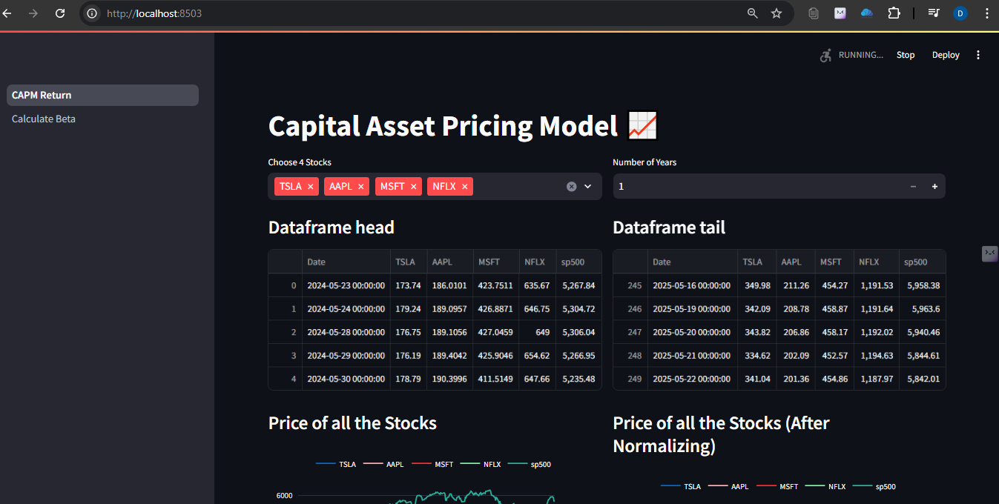
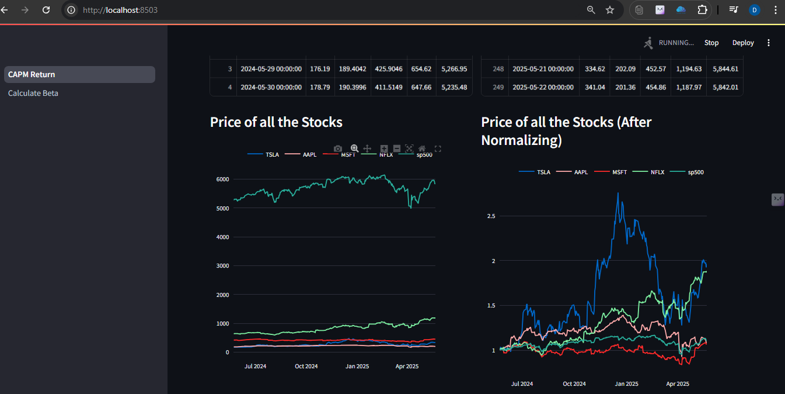
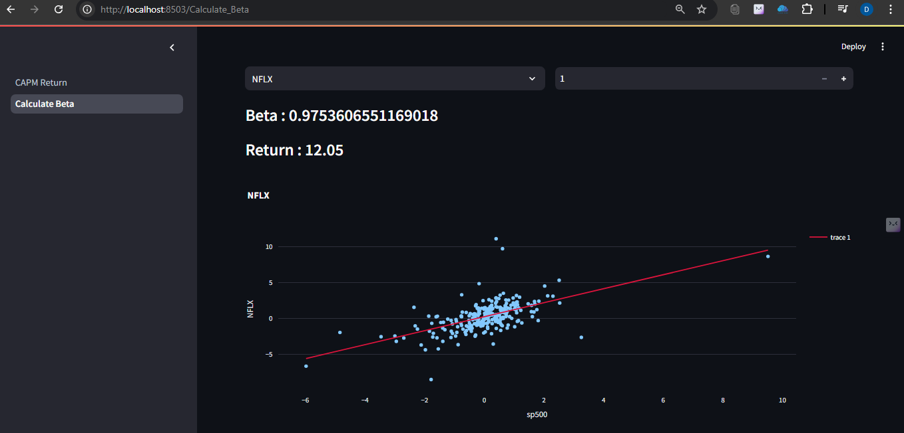

# 📊 Financial Analysis CAPM Project

This Streamlit web application allows users to analyze a stock’s risk and return using the **Capital Asset Pricing Model (CAPM)**. It’s designed for investors, finance students, and analysts who want to understand how beta and expected returns vary across different stocks.

> Developed by **Deepak Lokhande**

---

## 🔍 Features

- ✅ Input any stock ticker and risk-free rate
- ✅ Calculates expected return using CAPM formula
- ✅ Beta calculation from historical data
- ✅ Visualize stock vs. market returns
- ✅ Built with Streamlit, Python, and yfinance

---

## Screenshots








## 📌 How It Works

1. Enter the stock ticker (e.g., `AAPL`, `MSFT`)
2. The app fetches historical price data using **yfinance**
3. Calculates:
   - Daily returns
   - Beta (slope of regression line)
   - Expected return using CAPM:  
     `Expected Return = Risk-Free Rate + Beta * (Market Return - Risk-Free Rate)`
4. Shows plots of:
   - Daily returns comparison
   - Regression for beta

---

## 🚀 How to Run It Locally

```bash
# Step 1: Navigate to the project folder
cd Financial_Analysis_CAPM_Project

# Step 2: Create virtual environment (optional but recommended)
python -m venv venv
source venv/Scripts/activate  # On Windows
# OR
source venv/bin/activate      # On Mac/Linux

# Step 3: Install requirements
pip install -r requirements.txt

# Step 4: Run the Streamlit app
streamlit run CAPM_Return.py

```

📚 Technologies Used
> - Python

> - Streamlit

> - yfinance

> - NumPy, pandas, matplotlib, seaborn

> - Linear Regression (scikit-learn)

🧠 Skills Demonstrated
> - Financial modeling

> - CAPM application

> - Data cleaning & analysis

> - Web app deployment with Streamlit

📈 Example Use Case
An investor can input their chosen stock ticker and see if the expected return justifies the risk, comparing it to the market return and risk-free rate.

## 📬 Contact
Deepak Lokhande
> - 📧 deepak50384297@gmail.com
> - 🔗 LinkedIn
